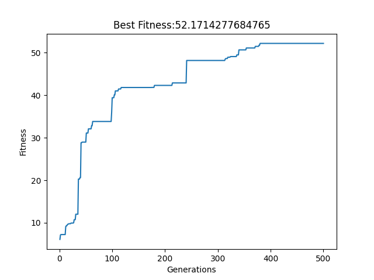
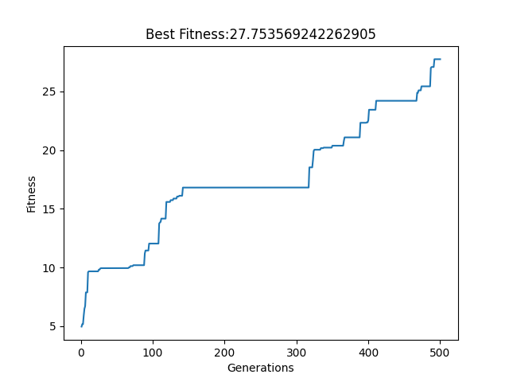

# Evoluation Simulation using Robots - Best Flyer
  
## To Run  
To evolve: change afterEvolution in search.py to false.
To simulate: change afterEvolution in search.py to true.
```
python search.py
```
## Goal of the Project  
The project aims to simulate the process of evolution. What is life and how does life forms evolve in a world? While people mainly believe in the idea of "Survival of the fitness" from Darwinism, it is hard to evolve robots in this way. With the use of computation, I can simulate how robots would evolve in a world dedicated to one single goal: To walk/crawl/swim to the furthest in limited time.  
  
## Methods  
### Population and random seed  
Evolution cannot be viewed only at one only population. Also, how the first creature is simulated is very important while I want to simulate with inheritance. Therefore, I used random seed, which indicates how random works (how random numbers are generated), to make sure that every population has a unique start.  
  
Because each step of mutation would genearte different results - I try my best to capture all the variable ways of mutation by having 10 versions of the population evolve at the same time so it's like while every random seed is a universe, there are 10 versions of the universes at the same time.  
  
Below is a simple illustration.  


### Body
To make sure that the bodies are randomly created, the only link (or part of body) that is determined is the first link. It will always be a 1x1x1 box at the origin. Any link that is added has a random size, each axis (or side) has a length from 0.2 to 2. The units are insignificant, as long as they have the same units. Any link added will randomly select one of the previously created link as its parent link and one of its face (6 faces if the parent link does not have any child link) to connect to. The position of the child link is decided by the position of the parent link, it's size, and the face it connects to.  
  
People will find a bug that you cannot have multiple links connecting to the same face. That's correct! I used a dictionary to keep track of the faces that are not used to solve that proble.  
  
Another issue may arrive that with the underlying mechanism of how the links and joints (the part that connecting the links) are encoded, one needs to keep track of the previous joint location - which I also did by keeping a dictionary.
  
Below is a simple illustration.  

  
### Mutation  
I used 5 ways to randomly modify and mutate:  
1. Change the weights  
Changing the weights meaning changing the effect of sensor link to motor link. A simple example of the effect on sensor on motor is how you would follow the direction that you feel a pull. However, instead of logic and intuition, our simulation uses mathematics and random values between -1 to 1.  
2. Add a Sensor  
After understanding the use of sensor and motor neurons, adding a sensor would be easy to understand. It's just to add another piece of skin to the robot.  
3. Remove a Sensor  
Similarly, this would be removing a piece of skin.  
4. Add a link  
Adding a link is part of the way to change the morphology - how the robot looks. This is a big change and usually results in big bumps or drops in the robot's fitness.  
5. Remove a link  
Removing a link is very similar to adding a link.  
  
Below is a simple illustration. In this simulation, links with sensor neurons attached are colored green and links without sensor neurons attached are colored blue. All joints have motor neurons attached - meaning that all joints can move. Every sensor link is connected to every motor/joint with various weights.   


### Fitness  
In this simulation, I did not do a lot of modification on fitness. Fitness is simply measured as how far the robot moves - the goal is to simulate evolution rather than try out different behaviors of the robots.  
However, after the simulation, I figured out that a more useful way to explain is to find the best flyer or bumper.  


## Results  
Here are the results of the fitness development of 10 randomly seeded population.  





From the results, we can see that some of the populations definitely perform better than the other ones. Along the way, many of the populations are stuck for hundreds of generations and then have a big bump that boosts the fitness to the tens. However, we also have populations that take minor steps along the way. From the fitness graphs, we can see that there's definitely room for additional improvement. The population's fitness has not reached it's highest and can still improve.  
To have better performance, one thing is to stop the generated body to bump into the sky by floor-to-body collision. I didn't have all bodies up on the ground because it would limit the variations of the bodies. I think making sure the bodies stay on the ground is an important aspect to accurately measure the fitness of the robot - especially when you are trying to measure their steps.  
I tried to fix this issue by increasing the number of time steps of the simulation. With 1/120 seconds per step, I used 18000 steps, which is 15 seconds to make sure that the body falls back on the ground and start to measure their walking, which didn't really help. An interesting thing in morphology I found is that generally the robots have one side deep in the ground so they can control the direction they fly - I guess a good way to adopt the simulation is to see it as a way to find the best flyer.    
Overall, I think my simulation gets pretty good results but still have room for improvement.  

## Credit
CS396 Northwestern University, Winter 2023  
r/ludobots  
Pyrosim  
Pybullet  
Karl Sims  
